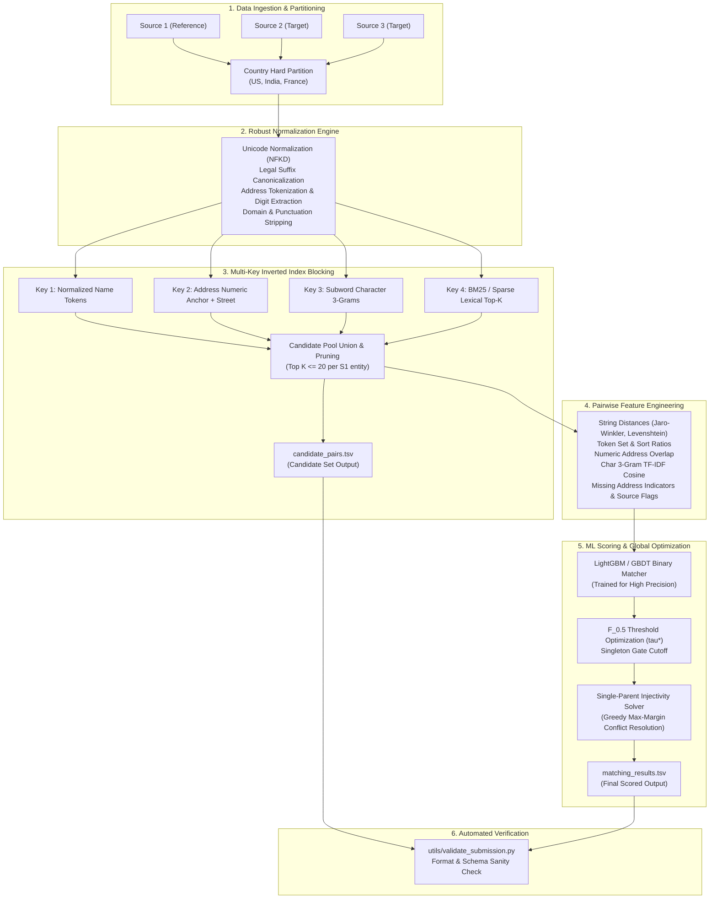

# System Architecture & Technical Design Specification
## Project: Scalable Multi-Source Business Entity Resolution (ER)

---

### 1. High-Level Architecture Overview

The entity resolution system is engineered as an end-to-end, high-throughput, multi-stage machine learning pipeline specifically designed for massive-scale record linkage under tight computational constraints (15 GB RAM, 12 CPU cores). 



---

### 2. Stage-by-Stage Technical Specification

#### Stage 1: Data Ingestion & Memory Management
- **Streaming Execution via Polars / PyArrow:** With 26.4 million records total (~2.5 GB raw text), loading naive Python string objects creates severe memory bloat. All file reads, transformations, and joins are executed using zero-copy streaming, columnar dictionaries, or chunked batch iteration.
- **Country Partitioning Invariant:** 
  $$\mathcal{S} = \mathcal{S}_{\text{US}} \uplus \mathcal{S}_{\text{India}} \uplus \mathcal{S}_{\text{France}}$$
  Because country matching is strictly invariant ($\text{cross-country recall loss} = 0$), the entire blocking and matching pipeline runs completely independently per country, reducing peak memory by up to 60% and enabling linear parallelization across CPU cores.

#### Stage 2: Domain-Agnostic Normalization Engine
To handle language variations, transliterations, and the unobserved test country (France), normalization avoids hard-coded lookups:
1. **Unicode NFKD & Accent Folding:** Characters like `é`, `ü`, `ñ` are decomposed and stripped of combining diacritical marks (`é` $\to$ `e`), making French and accented text directly comparable.
2. **Legal Entity Canonicalization:** Generic corporate suffixes are normalized across regions:
   - US: `incorporated`, `inc`, `corporation`, `corp`, `llc`, `ltd`
   - India: `private limited`, `pvt ltd`, `llp`, `limited`, `ltd`
   - France: `societe anonyme`, `sa`, `sarl`, `sasu`, `sas`, `eurl`, `sci`
3. **Domain & Punctuation Cleansing:** 
   - Web address normalization: `http://`, `www.`, `.com`, `.in`, `.fr`, `.org` stripped.
   - Punctuation standardized to whitespace; consecutive whitespace collapsed.
4. **Address Structural Extraction:**
   - Numerical tokens (building numbers, plot numbers, PIN codes) are extracted into a dedicated set $\text{digits}(r)$.

#### Stage 3: Multi-Key Inverted Index Blocking (Candidate Generation)
The goal of blocking is to minimize the candidate space while achieving **Pairs Completeness ($PC \ge 0.98$)**:

$$\text{Reduction Ratio } (RR) = 1 - \frac{|\mathcal{C}|}{|\mathcal{S}_1| \times (|\mathcal{S}_2| + |\mathcal{S}_3|)} \approx 0.9999$$

We build multi-pass inverted indexes within each country partition:
1. **Pass A (Name Core Index):** Inverted index on significant name tokens (length $\ge 3$, non-stopword).
2. **Pass B (Address Anchor Index):** Inverted index on `(primary_number + city/street_token)`. This recovers cases where the business name is completely altered (e.g. DBA names like `Dréxkor` matching `Maure Williams Colombier Inc`).
3. **Pass C (Character 3-Gram Subword Index):** High-frequency character 3-grams to capture typos, phonetic shifts, and Indic-to-Latin transliteration artifacts.
4. **Pass D (Lexical BM25 / Sparse TF-IDF Top-K):** Fast sparse cosine retrieval on concatenated `name + address` text.

**Candidate Pruning:** Candidates per $s_1$ are ranked by initial lexical overlap and capped at $K \le 20$. The resulting union forms `output/candidate_pairs.tsv`.

#### Stage 4: Feature Engineering Engine
For every generated candidate pair $(s_1, t)$ where $s_1 \in \mathcal{S}_1$ and $t \in (\mathcal{S}_2 \cup \mathcal{S}_3)$, a 28-dimensional dense feature vector $\mathbf{x}(s_1, t)$ is computed:

1. **Name Similarity Features:**
   - Jaro-Winkler distance: $JW(\text{name}_1, \text{name}_2)$
   - Normalized Levenshtein ratio: $1 - \frac{Lev(\text{name}_1, \text{name}_2)}{\max(L_1, L_2)}$
   - Token Sort Ratio & Token Set Ratio (order-invariant word comparisons)
   - Character 3-Gram Jaccard similarity: $\frac{|G_3(n_1) \cap G_3(n_2)|}{|G_3(n_1) \cup G_3(n_2)|}$
   - Length difference: $|len(n_1) - len(n_2)|$
   - Prefix match score (matching first 4 characters)
2. **Address Similarity Features:**
   - Address Levenshtein & Token Sort Ratio
   - Numeric Digits Jaccard similarity: $\frac{|\text{digits}_1 \cap \text{digits}_2|}{|\text{digits}_1 \cup \text{digits}_2|}$
   - Street / City token intersection ratio
   - Address missing indicator: $\mathbb{I}(\text{address}_t \text{ is None})$
3. **Cross-Field Interaction Features:**
   - Name-to-Address overlap (detects when a business name appears inside an address)
   - Harmonized TF-IDF character n-gram cosine similarity
4. **Source & Meta Features:**
   - Source indicator: $\mathbb{I}(t \in \mathcal{S}_2)$ vs $\mathbb{I}(t \in \mathcal{S}_3)$
   - Country categorical encoding

#### Stage 5: Precision-Tuned GBDT Classifier & Optimization
- **Model Architecture:** LightGBM Classifier (or fast XGBoost). Tree-based models are selected for:
  - Rapid inference speed (scoring millions of pairs per minute on CPU).
  - Robust handling of non-linear interactions between missing address flags and name similarities.
  - Native support for class imbalance.
- **Objective Function:** Binary cross-entropy with class weight regularization:
  $$\mathcal{L} = -\sum_{i} \left[ w_1 y_i \log p_i + (1 - y_i) \log (1 - p_i) \right]$$
- **Mathematical Threshold Tuning:**
  Rather than standard 0.5 classification threshold, $\tau^*$ is calculated via a grid search on a held-out validation set to directly maximize Macro-$F_{0.5}$:
  $$\tau^* = \arg\max_{\tau \in [0.1, 0.95]} \text{Macro-}F_{0.5}(\tau)$$
  Due to the $4\times$ penalty on False Positives, $\tau^*$ typically converges to a conservative boundary ($\tau^* \approx 0.70 - 0.85$).
- **Singleton Gate Cutoff:**
  If $\max_{t \in \text{Cand}(s_1)} P(s_1, t) < \tau_{\text{singleton}}$, then:
  $$\hat{Y}(s_1) = \emptyset$$
  ensuring singletons obtain the maximum score of 1.0.

#### Stage 6: Injectivity & Conflict Resolution Post-Processing
As established in the PRD, target records $t \in (\mathcal{S}_2 \cup \mathcal{S}_3)$ can belong to at most one reference record $s_1 \in \mathcal{S}_1$. 

If independent thresholding assigns record $t$ to multiple sources $\{s_1^A, s_1^B\}$, this is mathematically guaranteed to contain at least one false positive.
We enforce injectivity via **Greedy Maximum-Margin Assignment**:
$$\hat{s}_1(t) = \arg\max_{s_1 \in \mathcal{S}_1} P(s_1, t)$$
Record $t$ is removed from all lower-scoring candidate lists, eliminating false positive merges without lowering true positive recall.

---

### 3. Submission Package & Delivery Structure

The final deliverables strictly conform to the competition specifications:

```
<team_name>_submission.zip
├── output/
│   ├── matching_results.tsv        # Scored on leaderboard
│   └── candidate_pairs.tsv         # Blocking candidate set
├── code/
│   └── business_entity_resolution/
│       ├── src/                    # Pipeline source code
│       │   ├── data_loader.py
│       │   ├── normalizer.py
│       │   ├── blocking.py
│       │   ├── features.py
│       │   ├── model.py
│       │   └── postprocess.py
│       ├── README.md               # End-to-end reproduction guide
│       └── requirements.txt        # Pinned dependencies
└── Documentation_template.md       # Technical methodology writeup
```
